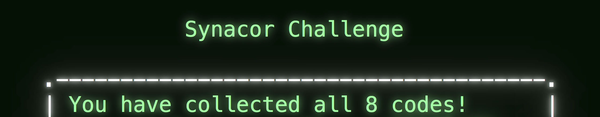

# synacor-challenge

The site and challenge can be found [here](https://challenge.synacor.com/).

I've tried to keep this spoiler free-ish. To that end I haven't included explicit solutions for example the program input.

This was a great little challenge which I completed over the course of around a week - definitely recommend it and trying
your best to complete independently!

There was one section I struggled with which I did end up with me resorting to googling. Fortunately this ended up with me
realising I had a silent bug preventing some standard (but important!) text from being emitted so it didn't spoil any of
the actual challenge for me - see the [coins](#the-coins) section.

## Commands
```bash
# Run the program
cargo r binaries/challenge.bin

# Disassemble the program
cargo r --bin syndis binaries/challenge.bin > diassemble.asm

# Brute force the teleporter solution - make sure you use --release!
cargo r --bin syntele --release

# Brute force the orb solution
cargo r --bin synorb
```

## The challenge

The initial resources you download consist of two files:
- an architecture specification for a 16 bit CPU consisting of 21 instructions, 15 bit address space, 8 registers and an unbounded stack
- a binary to be executed against the above architecture.

There are 8 codes to be found and submitted to the site by solving various puzzles.

Some of these are as simple as reading the resources, other require disassembling and modifying the binary.

I won't cover the exact solution or some of the easier codes but this readme does include information about how
I solved some of the more interesting puzzles.

Building the initial VM was relatively simple with my main problem managing the little endianess. Intially I preserved this
throughout the execution but later I refactored to just conver the program to big endian when reading it into memory - much easier!

## The harder codes (MINOR SPOILERS!)

## The maze

No idea if there is a smart solution for this - just explored until I stubmbled across the right room.

### The coins

This one was a nightmare! Prior to commit `704a09c` there was a subtle, silent(!) bug which prevented the clue to this puzzle being
printed. very frustrating.

I eventually resorted to googling tips (and even testing older binaries from other open source repos) which was how I discovered
the problem.

This was when I focused on refactoring the VM to run big-endian natively. The refactor somehow resolved the issue - at some point
I will go back and find out what the bug was but that's for another day!

Anyhow - the clue is an incomplete mathematical equation with 5 missing entries. Eash of these entries corresponds to one of 5
coins you find. Working out the order of the missing entries gives you the order the coins need to be used.

The equation is fortunately quite short so it only took a few minutes for me to solve (Maths background!). The alternative I have
seen online is brute forcing the 120 permutations but this would have taken me longer.

## The teleporter

This was a toughie and by far the challenge I found most interesting.

I think I had created the disassembler prior to this point while trying to diagnose the issue I mentioned in the coins section.
While it wasn't fruitful there it ended up being necessary here.

It was a little broken as it failed at the first memory address it hit which it expected to be an opcode but wasn't. A little tweak
to mark these as INVALID (I think DATA would have been more appropriate now I think about it) and I had the equivalent of an asm file.

The 8th register (r7) is the key here - looking through the disassembled code we find where it's being used to jump to the "billion year"
routine.

This was the gruelling part for me - attempting to translate the instructions into a rust routine so that we could brute force the answer.
It turns out this is an Ackerman function and there is no way to really get this to complete in a meaningful timeframe on the VM. See
[validate.asm](./validate.asm) for the extracted instructions.

It took a couple of hints online with the main one leading me to realise that the JT instructions should be treated as branches in a
method rather than calls to another method (which is what CALL is for!).

I ended up memoising the results with a HashMap and while it took a while I eventually got the value for the 8th register to allow
teleporting to work.

A quick update to main was required so that we
- set r7 to the appropriate value for teleportation
- skip the r7 = 0 self test
- skip the computation step
- ignore the computation step output check

Some optimisations were made to the caching after I went online for a sneaky look to check how others had approached the problem. This
just consists of using a 2D array over a HashMap for faster read/write access.

## The orb

Going to use a deque so we can continually add items to the back and pop from the front. The items will contain
- the current tile we are on (numeric)
- the route we have taken to get there
- the current value of the orb

Each time we pop an item we can
- check if the value is 30 and we are on the vault tile, if so stop and print the route
- otherwise
  - for each numeric tile we can reach via a different symbol create a copy of the item
  - add the symbol and number to the route
  - update the value based on the symbol and number
  - push the new item onto the back of the deque

For example we will start with a single item on the first (22) tile which will look something like
```
{
    value: 22,
    tile: 0, // a relative ID into an array or similar
    route: ""
}
```

Eash tile item will look something like
```
{
    op_string: "+ 4 ",
    op: |x| x + 4,
    neighbours: [1, 2, 4]
}
```

The actual data structures used in the implementation for [orb](./src/bin/orb/main.rs) ended up differring slightly but you get the
idea.

The first tile has 4 neighbours
- `+ 4` (up)
- `+ 4` (diagonal)
- `- 4`
- `- 9`

After processing the first tile there will be 4 items on the deque with values 26, 26, 18 and 31 based on the respective values.
The process will continue until we (hopefully) have a result!

It works! The program started throwing out solution routes which got longer and longer.

I ended up making some optimisations
- doing a hacky check to see if a underflow would occur and ignoring the path if so
- tracking the total number of steps so we could
  - track this when we hit the first solution
  - not follow any paths which go above the number of steps in the first solution
- the above meant by it's nature the deque would exhaust relatively quickly after the first solution - we can check if the deque is empty and stop processing

This meant the program returned 5 solutions which all checked out.

I put in the first solution and... no dice...

After a bit of diagnosis it turns out going back through the starting room causes the orb to disappear. Made another change to remove these links/edges and this conveniently left us with 1 result. To be fair I could have visually checked this as only 5 were returned initially.

Put in the solution, grab the last code and we're done!

